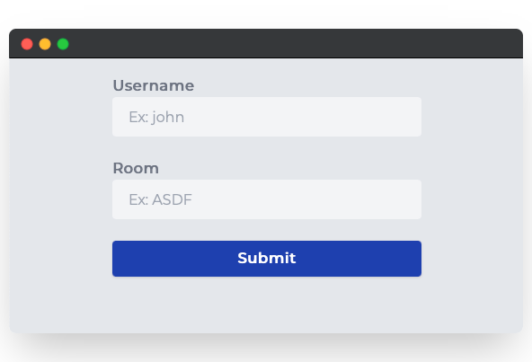
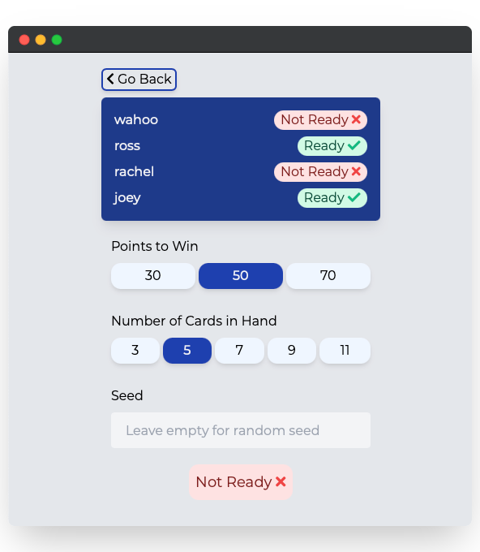
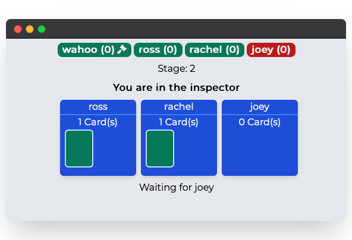
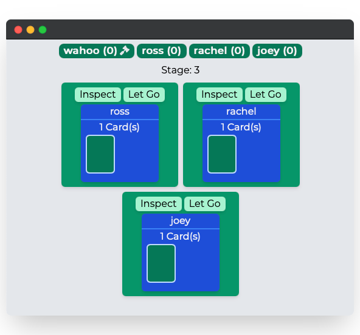
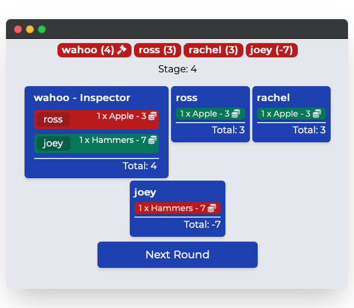

# Multiplayer Card Game
Visit https://inspectorgame.com to play!

## Description
This is a multiplayer card game built with Vue.js, Flask, and socket.io! This was taken on as a learning project, so I could build a modern websocket application and go through the full end-to-end process from development to production. This website is still definitely a work in progress, so expect iterative updates to be made.

## Screenshots
<div align="center">
  
  
  
  
  
</div>

## Running the Dev Version
```console
$ docker-compose up # to run the website
$ docker-compose up --build # if there are changes to any Dockerfile, requirements.txt, or package.json
$ docker-compose down # to remove network and all containers
```

Then, go to `localhost:3000` to see the website

> The container environment still needs work. The anonymous volumes used do not get deleted, so `docker volume prune` needs to be done every once in a while.

## Technical Details
When starting this project, I did not have too much web development experience. I just wanted to jump in and get started with a modern stack where I could experiement with different tools and technologies in an applied manner. 

A prototype of the website was created with React as the front-end and Flask as the back-end to serve as a minimum viable product. That website was hosted on an AWS EC2 instance and was very barebones. It was a great experience to learn React, but as a prototype I did not think about scope or UI.

Once the prototype gave me experience with Socket.io and the general process, I completely rewrote the website. Because I was familiar with Vue and Vuex at an internship, so I decided to retire React and continue with what I was already familiar with.

### Technology Stack
- Frontend
  - [Vue.js](https://vuejs.org/) - Javascript Framework
  - [Vuex](https://vuex.vuejs.org/) - State Management
  - [Vue-Socket.io-Extended](https://github.com/probil/vue-socket.io-extended) - Socket.io client wrapper library
  - [Tailwind CSS](https://tailwindcss.com/) - CSS Framework
  - [Cypress](https://www.cypress.io) - Testing Framework
- Backend
  - [Flask](https://flask.palletsprojects.com/en/2.0.x/) - Python Web Framework
  - [Flask-SocketIO](https://flask-socketio.readthedocs.io/en/latest/) - Socket.io server library
  - [Redis](https://redis.io/) - Database
- Other
  - Docker
  - AWS
  - Nginx

### Deployment Information
The website is fully hosted on AWS. The domain `inspectorgame.com` is registered with Route 53, which points to an EC2 instance. Nginx listens on incoming connections and routes root requests to the production build of the frontend. For other requests, such as `/socket.io`, Nginx serves as a reverse proxy for the backend which is also running on the EC2 instance. SSL is terminated at Nginx. For Redis, which is used as a database and message queue, ElastiCache is used.

A CD pipeline is also implemented with AWS CodeDeploy and AWS CodePipeline. The `main` branch of this repo is configured to deploy automatically when a new commit is pushed. `appspec.yml` and the `aws/` directory detail much of the information for the pipeline.

## TODO

### Development
- Frontend - [Vue Router](https://router.vuejs.org)
- Backend
  - Database locks for Redis
  - Different database (DynamoDB)
- Docker - Create multi-container backend with message queue
- Testing - E2E testing with Cypress

### Deployment
- Frontend
  - S3 Bucket - Static Site
  - CloudFront
- Backend
  - Elastic Beanstalk or ECS Fargate
  - CloudWatch Logs 
- Testing
  - CI with AWS CodeBuild
- CloudFormation for reproducability


### Features
- [ ] About page
- [ ] Instructions
- [ ] A room leader that can change settings
- [ ] Larger variety of cards
- [ ] General game balance
- [ ] Introduce max number of players
- [ ] Include link to share room
- [ ] Delete unused rooms after certain time